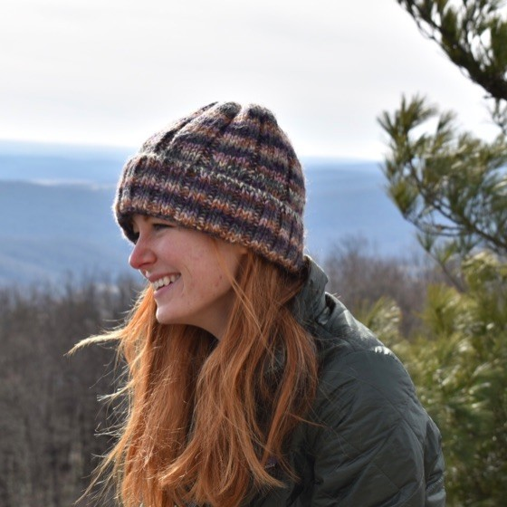

As a graduate student in statstics at Colorado State University, I am eager to learn and apply complex statistical methods to environmental data. I am passionate about teaching statistics at an introductory level and learning new and exciting teaching methods that incorporate active learning. In addition, I enjoy creating interactive visualizations with data I find interesting. 

